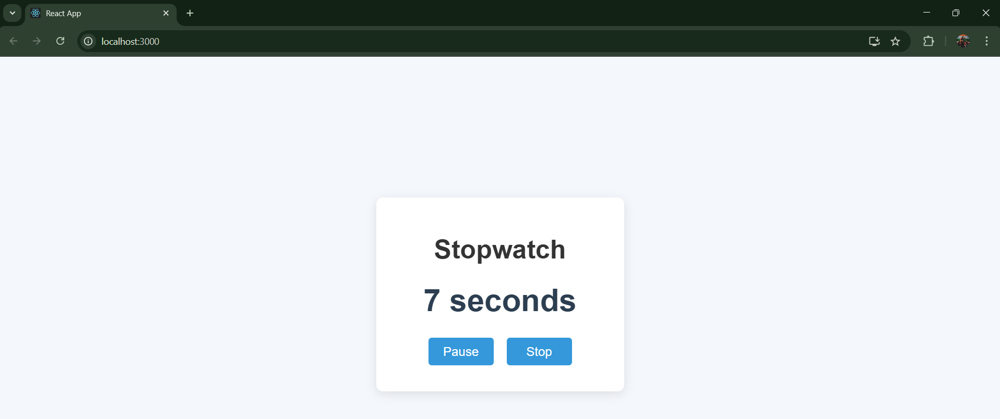

# Getting Started with React App
# ⏱️ Stopwatch using React

A simple and elegant **Stopwatch** built using **React.js**. This stopwatch allows you to start, pause, resume, and stop time with a user-friendly interface. 🚀

## 🌟 Live Demo
🔗 [Click here to use the Stopwatch](https://rajbhor123.github.io/StopWatch-using-React/)



## 🛠️ Features
⏯️ Start, Pause, Resume, and Stop functionality.  
⏳ Real-time updating seconds counter.  
⚛️ Built using **React Hooks** (useState & useEffect).  
🎨 Simple and user-friendly interface.  
📱 Responsive design for various screen sizes.  
⏲️ Efficient timer with **setInterval** and cleanup with **useEffect**.  

## 📸 Screenshot


## 🚀 Getting Started

### 🛠️ Installation
1. Clone the repository:
   ```sh
   git clone https://github.com/rajbhor123/StopWatch-using-React.git
   ```
2. Navigate to the project directory:
   ```sh
   cd StopWatch-using-React
   ```
3. Install dependencies:
   ```sh
   npm install
   ```

### ▶️ Run the Project
```sh
npm start
```
The app will start on **http://localhost:3000/** 🚀


---

🚀 Developed with ❤️ by [Raj Bhor]

